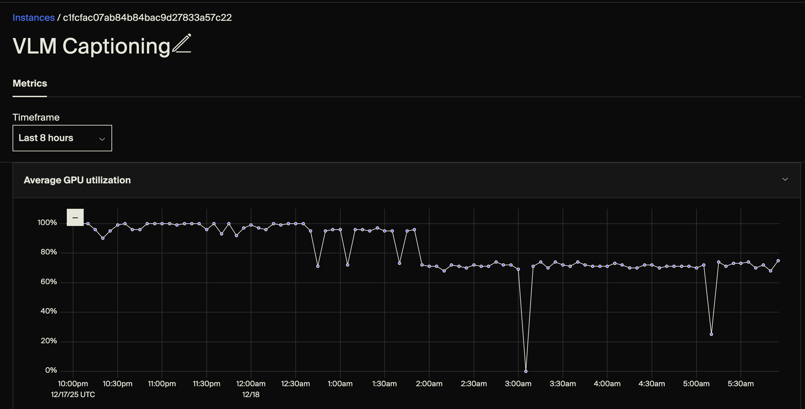
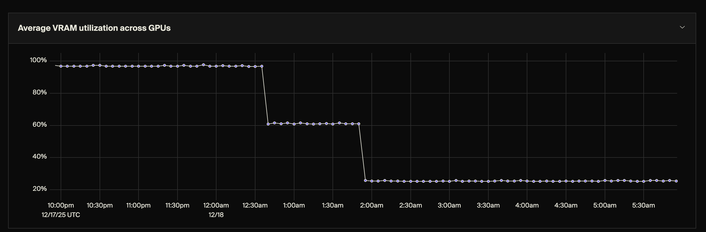
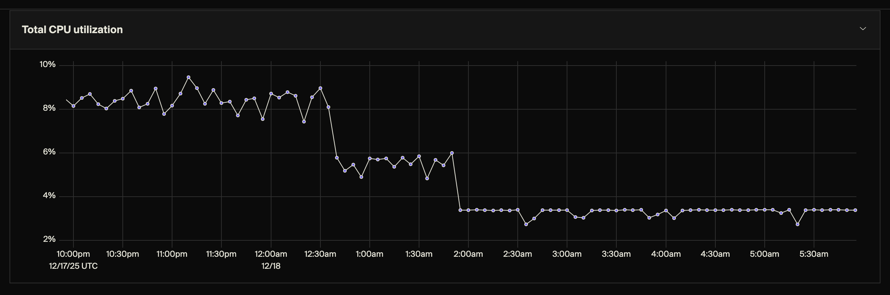
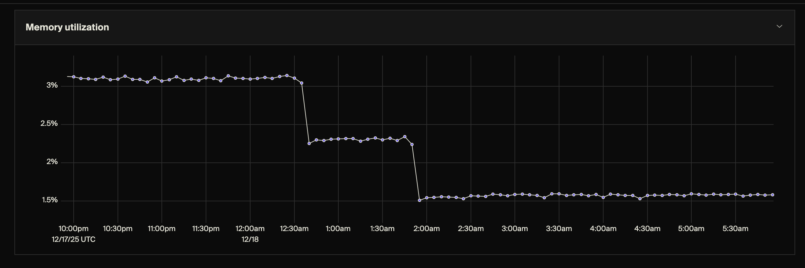
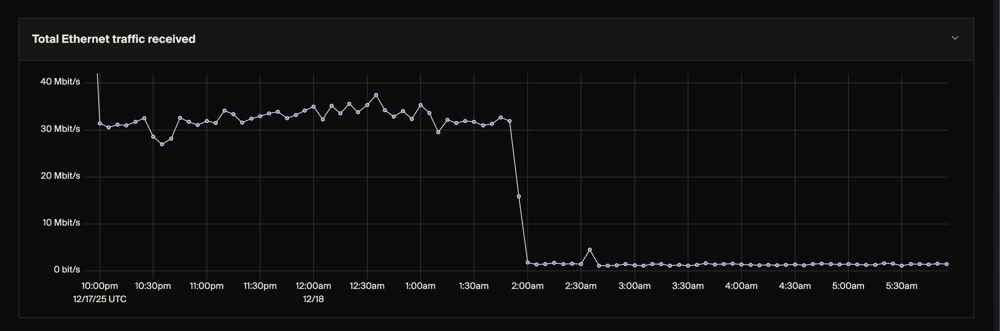
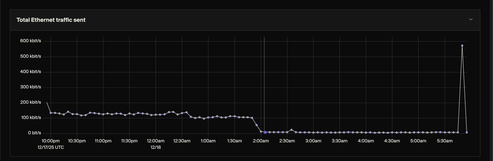
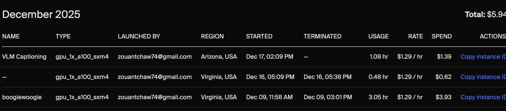
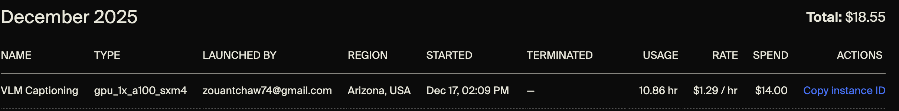

# VLM Captioning Run Metrics

Detailed analysis of the Lambda Labs A100 GPU run for VLM image captioning.

**Date:** December 17-18, 2025
**Instance:** Lambda Labs A100 40GB (Arizona, USA)
**Model:** LLaVA 1.5 7B
**Task:** Caption ~14,800 historical photos from Montreal Archives

---

## Summary

| Metric | Value |
|--------|-------|
| **Total Runtime** | 10.86 hours |
| **Total Cost** | $14.00 |
| **Rate** | $1.29/hour |
| **Images Captioned** | 12,304 (83%) |
| **Errors** | 23 (0.2%) |
| **Images Remaining** | ~2,500 |

---

## Timeline

| Time (UTC) | Event |
|------------|-------|
| Dec 17, 7:09 PM | Instance launched |
| Dec 17, 7:49 PM | 3 parallel processes started |
| Dec 18, 12:30 AM | Chunks 0 & 1 complete (10,000 images) |
| Dec 18, ~2:00 AM | Only chunk 2 running |
| Dec 18, 6:00 AM | Job stopped manually (chunk 2 at 46%) |
| Dec 18, 6:15 AM | Results downloaded, instance terminated |

---

## Metric Analysis

### 1. GPU Utilization



**Observations:**
- **10pm - 12:30am:** ~95-100% utilization with 3 parallel processes
- **12:30am - 1:30am:** Drops to ~70-80% as chunks finish
- **~3am:** Brief dip to ~0% (monitor script restart)
- **After 3am:** Steady ~70-75% with single process

**Key Insight:** The drop from ~100% to ~70% when going from 3 processes to 1 confirms the job was **I/O bound**, not GPU bound. With 3 processes, the GPU was always busy (while one waited for network, another was inferencing). With 1 process, the GPU sat idle during image downloads.

---

### 2. VRAM Utilization



**Observations:**
- **10pm - 12:30am:** ~95-100% VRAM (three model copies loaded)
- **12:30am - 1:30am:** Drops to ~60% (two models)
- **After 2am:** Drops to ~25% (single model)

**Key Insight:** Each LLaVA 7B model copy uses ~25% of the 40GB VRAM (~10GB). Three copies fit comfortably. The A100 40GB was appropriately sized for this workload.

---

### 3. CPU Utilization



**Observations:**
- **3 processes:** ~8-10% CPU utilization
- **2 processes:** ~5-6% CPU utilization
- **1 process:** ~3% CPU utilization

**Key Insight:** CPU was never a bottleneck. The work is GPU-bound for inference and network-bound for image fetching. CPU just orchestrates.

---

### 4. Memory (RAM) Utilization



**Observations:**
- **3 processes:** ~3% RAM (~7GB of 230GB)
- **1 process:** ~1.5% RAM (~3.5GB)

**Key Insight:** System RAM was vastly over-provisioned. The A100 instance comes with 230GB RAM, but we only needed ~7GB peak. A smaller instance would have worked.

---

### 5. Network Traffic - Received (Downloads)



**Observations:**
- **10pm - 1:30am:** ~30-35 Mbit/s sustained download
- **After 2am:** Drops to near 0

**Key Insight:** This is the **smoking gun** for our I/O bottleneck.

With 3 processes downloading in parallel: ~30-35 Mbit/s
With 1 process: Nearly 0 Mbit/s (waiting between downloads)

The single process was spending most of its time waiting for each image to download from Montreal's servers (~20-30 sec/image), with the GPU sitting idle between inferences.

**Calculation:**
- Average image size: ~500KB
- At 30 Mbit/s: ~500KB / (30/8 MB/s) = ~0.13 sec download time
- Actual time per image: ~6 sec (3 processes) to ~27 sec (1 process)
- Difference is network latency and server response time, not bandwidth

---

### 6. Network Traffic - Sent (Uploads)



**Observations:**
- Very low throughout (~100-150 kbit/s)
- Spike at ~5:30am to ~600 kbit/s

**Key Insight:** The spike at 5:30am was us downloading the results via SCP. The low baseline is just HTTP request headers being sent to Montreal's servers.

---

### 7. Billing

**Early snapshot (1 hour in):**


**Final billing:**


| Run | Duration | Cost |
|-----|----------|------|
| VLM Captioning | 10.86 hr | $14.00 |
| Previous CLIP run (Dec 9) | 3.05 hr | $3.93 |
| Test run (Dec 16) | 0.48 hr | $0.62 |
| **Total December** | | **$18.55** |

---

## Performance Analysis

### Throughput Comparison

| Phase | Processes | Records/Hour | Sec/Image | Bottleneck |
|-------|-----------|--------------|-----------|------------|
| Early (3 procs) | 3 | ~2,500 | ~6 sec | Network (parallel) |
| Late (1 proc) | 1 | ~140 | ~27 sec | Network (serial) |

### Why Single Process Was 4x Slower

```
3 Processes (parallel I/O):
  Process A: [download]────────[GPU]──[download]────────[GPU]──
  Process B: ──[download]────────[GPU]──[download]────────[GPU]
  Process C: ────[download]────────[GPU]──[download]────────
  GPU:       ████████████████████████████████████████████████
             (always busy - one finishes, another is ready)

1 Process (serial I/O):
  Process:   [download]────────[GPU]──[download]────────[GPU]──
  GPU:       ░░░░░░░░░░░░░░░░░░████░░░░░░░░░░░░░░░░░░░░████░░░
             (idle while waiting for network)
```

### Amdahl's Law Applied

With 3 processes, we achieved ~3.1x speedup (slightly better than theoretical 3x maximum).

This "super-linear" speedup occurred because:
1. **Processes are independent** - no shared serial portion
2. **I/O overlap** - while one waits for network, another uses GPU
3. **External bottleneck** - network latency is hidden by parallelism

---

## Lessons Learned

### What Worked Well

1. **Parallel processes** - 3x speedup was critical for cost efficiency
2. **A100 40GB** - Right-sized for 3x LLaVA 7B model copies
3. **Incremental output** - Partial results saved despite early termination
4. **nohup + background** - Jobs survived terminal disconnection

### What Could Be Improved

1. **Use R2 instead of Montreal's servers** - Our images in R2 would download faster
2. **Batch downloads** - Pre-fetch images while GPU is busy
3. **Smaller instance RAM** - We used 3% of 230GB RAM
4. **Auto-upload results** - Set up transfer.sh or R2 upload before termination

### Cost Optimization

| Strategy | Potential Savings |
|----------|------------------|
| Use R2 for images | ~50% (faster downloads = less GPU idle time) |
| Run 4-5 processes | ~20% (more I/O overlap) |
| Spot/preemptible | ~60% (if available) |

---

## Files

```
docs/metrics/vlm-captioning/
├── README.md                  # This file
├── 01-billing-early.png       # Billing after 1 hour
├── 02-gpu-utilization.png     # GPU % over time
├── 03-vram-utilization.png    # VRAM % over time
├── 04-cpu-utilization.png     # CPU % over time
├── 05-memory-utilization.png  # RAM % over time
├── 06-network-sent.png        # Upload bandwidth
├── 07-network-received.png    # Download bandwidth
└── 08-billing-final.png       # Final billing
```

---

## Related Documentation

- [CSAPP Lessons from VLM Captioning](../../csapp-lessons-vlm.md) - Systems programming concepts learned
- [Vision AI Primer](../../vision-ai-primer.md) - Understanding VLMs, CLIP, and embeddings
- [Architecture Diagram](../../architecture.mmd) - Full data pipeline including VLM step
