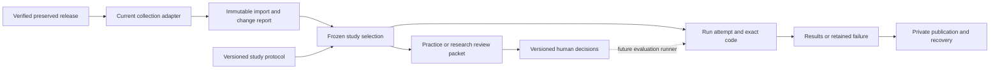

# Research studies over a growing archive

Implemented October 2, 2026 in `pipelines/research_platform`. This is the common
source, study, annotation and run foundation. The existing collection is the only
implemented source. Fresh OCR/caption execution and retrieval evaluation follow
after pilot inputs and the evaluation protocol are ready.

## Resource boundary

| Resource | Role |
| --- | --- |
| `mtl-archives-research-catalog` | Existing acquisition/release catalog; running backfill owns its frozen schema and receipts |
| `mtl-archives-research-studies` (`37d7c2de-2178-4050-902f-4b456e59916a`) | New append-only source imports, study versions, selections, review versions, code and run events |
| Private `mtl-archives-research-sources` | Shared preserved metadata/master/delivery bytes |
| Private `mtl-archives-research-derived` | Shared thumbnails and new hash-addressed study/analysis artifacts |
| `mtl-archives-research-transfer` | Existing authenticated private artifact transport; its acquisition selector and deployment are unchanged |

The module's write configuration accepts these exact research resources and
checks D1 ID/name and R2 privacy before cloud mutations. It exposes no production
SQL, app deployment, Vectorize writes or product promotion. The study schema is
module-local, never an app migration. The original `pipelines/research_data`
builder and active supervisor remain unchanged.



## What is executable now

- Register the current source, study definitions and draft/pinned processing recipes.
- Import a byte-verified `mtl-research-data-v1` release or a completed
  `mtl-research-backfill-v1` phase plus its hash-matching frozen plan. Running
  SQLite checkpoints are not release inputs. Full phase failures remain visible.
- Compare an import with a prior version: added, revised, removed and unchanged
  records. Earlier studies retain their earlier exact inputs.
- Freeze seeded selections with exact asset roles and metadata versions.
  Identical byte groups stay together; reviewed family maps can join further
  groups. Membership is sharded, so a larger corpus does not require a new
  monolithic metadata object. A whole group can exceed the requested target count.
- Run a descriptive coverage study: hash/size verification, availability,
  uniqueness, dimensions, inherited lineage and legacy metadata presence.
- Build separate OCR transcription, caption-claim and query/image relevance
  packet structures. Import partial or complete, versioned reviewer decisions.
- Keep separate started/succeeded/failed attempt events. A retry creates another
  attempt. Preserve exact Python/SQL runner source, configuration, environment,
  input hashes, output references and measured timing.
- Publish bounded derived metadata through conditional R2 writes with server
  readback checks; verify D1 rows before the complete publication marker. Replay
  is safe; conflicting immutable rows fail. Restore into a new local ledger and
  verify selected archive bytes independently.

Only `descriptive_coverage_v1` executes in this milestone. Registering another
study or recipe does not run a model. Future OCR/caption/retrieval runners must
consume these fixed versions and satisfy their output contracts; they are not
implemented here. This is a CLI and data contract, not a research dashboard or
automatic product adoption system.

## The two study definitions

`examples/coverage-study.json` has a frozen descriptive protocol. Its results
describe available inputs; they establish no OCR accuracy, caption quality or
retrieval improvement.

`examples/retrieval-study.json` remains **in preparation**. Its question is:

> Do fresh OCR and image descriptions improve French/English historical-image
> retrieval, and does separating evidence channels reduce unsupported place/date matches?

The protocol still needs independent development/heldout query intents, family
review, a corpus, pinned baselines/candidates, thresholds, uncertainty methods
and adequate human reference judgments. The 30-record engineering release tests
the implementation and is not the proposed 100–200-image development pilot.

## Source and derivation contract

The current adapter retains published `mtl:url-v1:` record identities. The suffix
is SHA-256 of the canonical JSON string encoding of the **exact** source URL,
including that historical serialization convention. Sequential filenames are
aliases. Shared bytes do not merge distinct archival records. URL migrations
require an explicit reviewed alias mapping.

Every normalized record preserves its metadata-version reference, asset role,
exact byte hash, parent association, recorded lineage and acquisition outcome.
Inherited source/serving/derived assertions remain separated. Historical input
hashes are not invented. Delivery images are not silently substituted for
masters; byte preservation does not imply master decoding.

A future source adapter must define its namespace, native identity, metadata
mapping, source conditions and refresh policy; emit this normalized record/asset
contract; and pass identity/version/failure fixtures before registration accepts
it. The present allowlist intentionally accepts only `mtl-preserved-v1`. No new
source has been selected, and arbitrary datasets are not automatically importable.

The draft OCR and visual-caption recipes explicitly leave model revision,
render resolution/color/tiling and runtime unresolved. A pinned recipe requires
those fields and exact render-code identity. Pixels-only recipes cannot include
source metadata; source-conditioned captioning is a different evidence channel.
Future raw outputs must retain record version, master/input hash, actual render
hash, engine/configuration, raw response, timing/usage and per-item outcome. A
recipe declaration alone does not verify a runner's implementation.

## Selection, labels and heldout data

- A selection freezes the import, study version, seed, required roles, actual
  membership, exclusions and partition policy. No unknown family boundary is
  represented as reviewed.
- Research image splits require a complete family map with a declared human
  reviewer. Exact byte duplicates are grouped even for engineering selections.
- Retrieval uses one shared image corpus. Development and heldout separation
  belongs to **query intents**, with paired French/English wording. Duplicate
  intent identities or exact normalized query texts across partitions are
  rejected. Human review must also catch semantic paraphrases and related intents.
- A packet is bound to an exact snapshot/task/image hash. Relevance packets
  contain queries and images without generated captions, source titles or system
  names. Caption tasks require claims in a hash-verified derivation for that
  exact image input. OCR tasks retain readable text/no-text/uncertain outcomes.
- A label version records reviewer declaration, independence, task, item ID,
  elapsed review time and uncertainty. Practice labels are identified as practice.
  Empty reviewer templates contain no suggested decisions. Partial versions
  retain missing item IDs.
- Reviewer identity/independence is self-declared, not authenticated by the CLI.
  Every imported label version remains `pending_quality_review`; it is not
  automatically gold. Agreement/adjudication and benchmark eligibility remain
  work for the evaluation milestone.
- Heldout partitions are logical data contracts, not separate access-control
  accounts. The owner can read the private archive. Evaluation runners must
  refuse heldout references during development and record the final protocol lock.

## Commands

Use Python 3.12 and the existing `.venv-bulk` environment, or install this module's
`requirements.txt`. Local operations and tests use the standard library;
authenticated private transport uses `requests`, and cloud catalog operations
use the installed `cf` CLI. Secrets stay outside Git and artifacts, in the
existing mode-0600 transfer credential file referenced by `config.json`.

From the isolated research checkout:

```bash
.venv-bulk/bin/python -m unittest discover -s pipelines/research_platform -p 'test_*.py' -v

.venv-bulk/bin/python pipelines/research_platform/smoke.py \
  --root /absolute/path/to/new/research-run \
  --release-run /absolute/path/to/verified/release-run

.venv-bulk/bin/python pipelines/research_platform/run.py \
  --root /absolute/path/to/research-run cloud-bootstrap

.venv-bulk/bin/python pipelines/research_platform/run.py \
  --root /absolute/path/to/research-run \
  --blob-root /absolute/path/to/verified/release-run/blobs cloud-publish

.venv-bulk/bin/python pipelines/research_platform/run.py \
  --root /absolute/path/to/empty/recovered-run cloud-restore \
  --publication PUBLICATION_SHA256

.venv-bulk/bin/python pipelines/research_platform/run.py \
  --root /absolute/path/to/recovered-run --private-read verify \
  --snapshot SNAPSHOT_SHA256
```

`run.py --root ... --help` lists `source`, `import-release`, `study`, `freeze`,
`queries`, `families`, `recipe`, `packet`, `labels`, `coverage`, `code`, `list`
and `inspect`. Definitions/policies use JSON files, never shell-interpolated SQL.
`inspect --export /private/path.json` exports a full payload; console summaries
avoid dumping inherited OCR and private data.

Import a completed full phase without changing its acquisition job:

```bash
.venv-bulk/bin/python pipelines/research_platform/run.py \
  --root /absolute/path/to/research-run --private-read import-release \
  --source SOURCE_VERSION_ID \
  --release /absolute/path/to/backfill/legacy_delivery-release.json \
  --plan /absolute/path/to/backfill/plan.json
```

For a source refresh, pass `--previous IMPORT_ID`. Use a new selection definition
to freeze appropriate membership over the new import. Existing selections never
float to “latest”. The original-source phase is separately importable and may
remain limited by master validation.

To submit a review, copy the exported response template, set a reviewer/key and
add decisions such as:

```json
{
  "item": "EXACT_PACKET_ITEM_SHA256",
  "value": "transcribed",
  "text": "The readable text, preserving spelling and line breaks",
  "seconds": 45,
  "note": "Any uncertainty or legibility issue"
}
```

Then run `labels --packet PACKET_ID --response /private/completed-response.json`.
The review packet is a portable JSON structure and rubric; this milestone does
not add a labeling web application. Reviewers need the exact referenced images,
not generated descriptions offered as answer keys.

## Verification and limits

The test suite covers published identity compatibility, immutable refreshes,
corrupt bytes, duplicate/family leakage, query partition conflicts, failure
retention/retry, annotation binding, unpinned recipes, completed/incomplete bulk
adapters, publication rollback/conflicts/replay and recovery.

The live acceptance check uses the existing 30-record preserved release, both
study definitions, an unlabeled OCR practice packet, a descriptive run and a
fresh cloud recovery. See [the acceptance record](acceptance.md).

The coverage runner makes zero model calls. It records model cost as zero and
storage/transport cost as unknown; `max_usd` is not a total Cloudflare billing
limit. Its wall-time budget is checked at completion, not an external hard kill.
Expensive runners need cancellation/concurrency/spend controls before execution.
Do not treat report completion, inherited model confidence or fluent captions
as a hypothesis result. Product promotion requires a separate serving candidate,
evaluation and owner decision.
